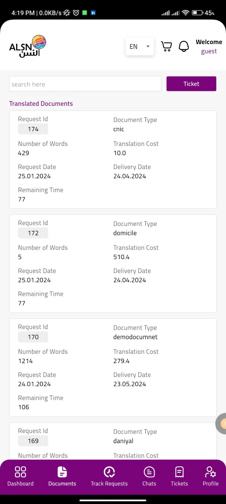

# ALSN-App

INTRODUCTION

ALSN Translator is a cutting-edge language translation system designed to simplify and elevate your multilingual communication experiences. Whether you need documents translated, real-time chat translations, or instant access to a vast array of languages, ALSN Translator is your trusted companion.

ALSN FEATURES:

GUEST APPLICATION
1. To access our services, guests must complete the registration process, ensuring a seamless experience.
2. Guests can log in to the system to unlock a wide range of functionalities tailored to their needs.
3. Explore your personalized dashboard, featuring a comprehensive overview of translation requests, translated documents, and real-time status updates.
4. Effortlessly submit a translation request by scanning or uploading documents in Word or PDF format. Choose the source and target languages, document type, and more to tailor the translation to your preferences.
5. Keep tabs on the progress of your application based on the selected service, ensuring transparency throughout the translation process.
6. Download or share your translated documents directly from the portal within a 90-day window, providing flexibility and convenience.
7. Facilitate a seamless transaction by making payments for the requested services, enabling you to access and download your translated documents promptly
8. Should you encounter delays or have any queries, initiate a chat with our ALSN for prompt assistance and updates on your requests.
9. Address any concerns related to user experience, document translation, or other issues by generating support tickets, ensuring timely resolution.
10. Monitor the progress of your submitted tickets, view responses from ALSN, and engage in a streamlined communication process.
11. Share your valuable feedback on our services, contributing to continuous improvement. Your insights not only benefit us but also enhance the experience for fellow guests.

TRANSLATOR APPLICATION
1. Access the system by logging in, enabling translators to leverage a suite of powerful functionalities.
2. Take control of your personal information and keep it up-to-date with the ability to manage your profile effortlessly.
3. Navigate through your dedicated dashboard, providing an insightful overview of your ongoing translations and relevant information.
4. Efficiently handle translation requests by accepting or rejecting assignments delegated by the Translation Office, ensuring a streamlined workflow.
5. Exercise control over your translations, review comments or remarks from the allocation process, and make necessary edits to enhance the quality of your work.
6. Initiate discussions or seek clarification by engaging in a direct chat with the Translation Office responsible for assigning translations to you.

TRANSLATION OFFICE APPLICATION
1. Initiate the registration process by submitting your application, unlocking access to a world of translation management capabilities.
2. Seamlessly log in to the system, providing Translation Offices with the tools needed to efficiently manage translation processes.
3. Gain valuable insights by viewing comprehensive statistics on your dedicated dashboard, offering a holistic overview of translation activities.
4. Effortlessly handle both regular and special service orders received from guests and super admin, ensuring effective order management.
5. Exercise control over your team of translators with the ability to add, view, edit, and delete translator profiles, optimizing your workforce.
6. Allocate translation tasks to designated translators based on specific details, facilitating a smooth and organized workflow.
7. Take charge of the translation process by managing the status of each translation task. Approve completed translations or request amendments for further refinement
8. Effectively handle requests for amendments received from both the admin and guests, ensuring prompt and accurate resolution.
9. Facilitate communication by engaging in direct chats with assigned translators, fostering collaboration and addressing any queries or concerns efficiently.

ADMIN PORTAL
1. Access the system with ease, utilizing secure credentials to unlock the full suite of administrative functionalities.
2. Gain comprehensive insights by reviewing dashboard statistics, empowering the Super Admin with valuable data for informed decision-making.
3. Take control of user management, ensuring efficient business operations by adding, modifying, or removing users as needed.
4. Customize roles to align with the dynamic needs of the business, providing a flexible and tailored approach to user responsibilities.
5. Review and process registration applications submitted by Translation Offices, maintaining oversight of the onboarding process.
6. Effortlessly oversee and manage Translation Offices, ensuring seamless communication and coordination within the system.
7. Navigate through order details, assign tasks to specific Translation Offices, or withdraw orders when necessary, optimizing order management processes.
8. Take charge of financial matters within the system, allowing the Super Admin to oversee and manage financial transactions effectively.
9. Address user concerns by viewing, resolving, and responding to tickets generated by guests, fostering a responsive and supportive environment
10. Facilitate communication with other users in the system through a built-in chat feature, promoting collaboration and quick issue resolution.

TECHNOLOGIES & TOOLS USED
1. Flutter
2. .NET Server Side(BACKEND)
3. MySQL Database
4. Azure/AWS translation services
5. REST APIs
6. ReactJS
7. Moyassar Payment gateway
8. SMS API
9. Sendrid
10. Syncfusion

GUEST SIDE SCREENSHOTS

            
